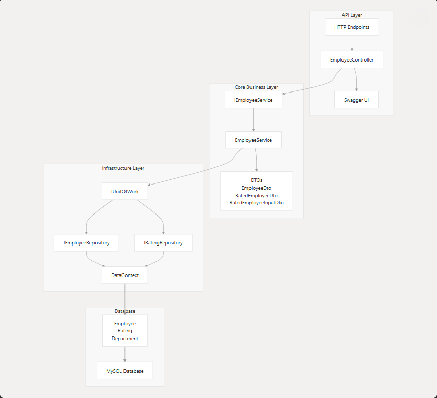
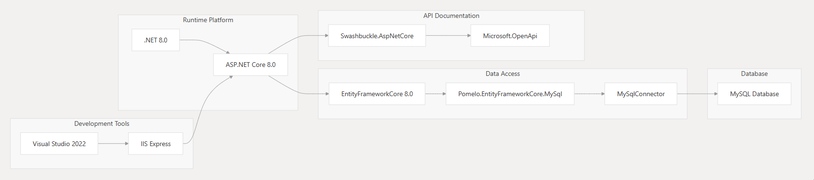
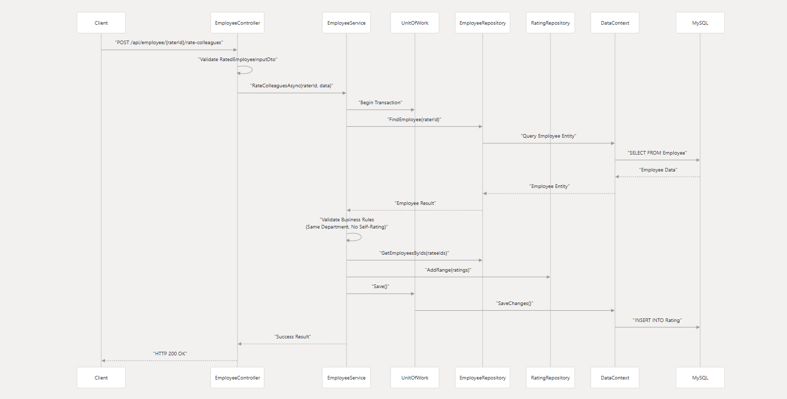
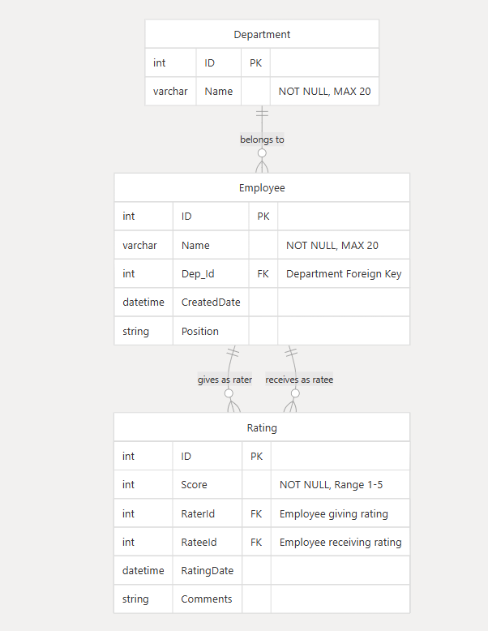

# 📊 CompanyEvaluationsAPI Documentation

## 🗂️ Overview

This document provides a comprehensive overview of the **CompanyEvaluationsAPI** repository, which implements an employee evaluation system using **ASP.NET Core Web API**.

The system allows employees to rate their colleagues **within the same department** while enforcing business rules and maintaining data integrity.

> For detailed architectural insights, refer to:
- [System Architecture](#-system-architecture-overview)
- [Technology Stack](#-technology-stack-and-dependencies)
- [HTTP Endpoints & Testing](#)

---

## 🎯 Purpose and System Scope

**CompanyEvaluationsAPI** is a modern **.NET 8.0** web application designed to manage employee performance evaluations within an organization.

It provides **RESTful APIs** for:
- Rating colleagues
- Retrieving employee data
- Managing departments

The architecture follows **Clean Architecture** principles, separating concerns across API, business, and data layers.

### ✅ Core Capabilities

- 📈 Employee rating system (1–5 scale)
- 🛡️ Department-based access control
- 🚫 Self-rating & duplicate rating prevention
- 📘 RESTful API with Swagger (OpenAPI)
- 💾 MySQL persistence with EF Core
- ⚙️ Asynchronous request handling

---

## 🧱 System Architecture Overview
- The application implements a layered architecture with clear separation between presentation, business logic, and data access concerns:

## Layer Responsibilities:

| **Layer**         | **Components**                        | **Responsibilities**                                                  |
|-------------------|----------------------------------------|------------------------------------------------------------------------|
| `API Layer`       | `EmployeeController`, `Swagger UI`     | Handles HTTP requests, model binding, validation, response formatting |
| `Core Layer`      | `IEmployeeService`, `EmployeeService`, DTOs | Business logic, validation rules, orchestration                        |
| `Infrastructure`  | Repositories, `UnitOfWork`, `DataContext` | Data access, transaction management, DB operations                     |
| `Database`        | MySQL, Entity models                   | Data persistence, relationships, constraints                          |

---

## ⚙️ Technology Stack and Dependencies

The system leverages modern .NET ecosystem technologies with MySQL as the primary data store:

### 📦 Key Package Dependencies

| **Package**                      | **Version** | **Purpose**                            |
|----------------------------------|-------------|----------------------------------------|
| Microsoft.EntityFrameworkCore    | 8.0.0       | ORM and data access                    |
| Pomelo.EntityFrameworkCore.MySql | 8.0.0       | MySQL provider for EF Core             |
| MySqlConnector                   | 2.3.5       | MySQL database connectivity            |
| Swashbuckle.AspNetCore           | 6.6.2       | OpenAPI/Swagger docs                   |
| Microsoft.OpenApi                | 1.6.14      | OpenAPI spec support                   |

---

## 🔁 Core Business Workflow

The request pipeline enforces business rules and preserves consistency:

### 🧾 Business Rules Enforced

- ✅ Employees can only rate colleagues in the **same department**
- ❌ **Self-rating** is prohibited
- ❌ **Duplicate ratings** are blocked
- ✅ Rating score must be **1–5**
- 🧩 All operations are **transactional**

---

## 🧩 Data Model and Entity Relationships

The system maintains a simple but effective relational data model centered around employee evaluations:

### 📄 Entity Characteristics

- **Department**: Logical grouping of employees
- **Employee**: Can give and receive ratings
- **Rating**: Links a rater to a ratee with score and metadata

---

## 🧰 Development Environment and Build System

The project is built using **Visual Studio 2022**, with helpful tools and integrated features.

| **Component**          | **Purpose**                          | **File Reference**                                     |
|------------------------|--------------------------------------|--------------------------------------------------------|
| Visual Studio 2022     | Primary IDE                          | `CompanyEvaluationsAPI.sln`                           |
| IIS Express            | Dev web server                       | `.vs/CompanyEvaluationsAPI/DesignTimeBuild/.dtbcache.v2` |
| GitHub Copilot         | AI code assistant                    | `.vs/CompanyEvaluationsAPI/DesignTimeBuild/.dtbcache.v2` |
| .NET 8.0 SDK           | Build and runtime                    | `.vs/CompanyEvaluationsAPI/DesignTimeBuild/.dtbcache.v2` |
| EF Core Migrations     | Database schema management           | `CompanyEvaluationsAPI/Documntation.md`               |

### 🔑 Key Development Features

- 🧠 IntelliSense and semantic analysis
- 🐞 Integrated debugging
- 🔄 Automatic NuGet dependency resolution
- 🚀 Hot reload support
- 📘 Swagger UI for API testing

---

> © 2025 CompanyEvaluationsAPI – Built with ❤️ using .NET 8 & EF Core
